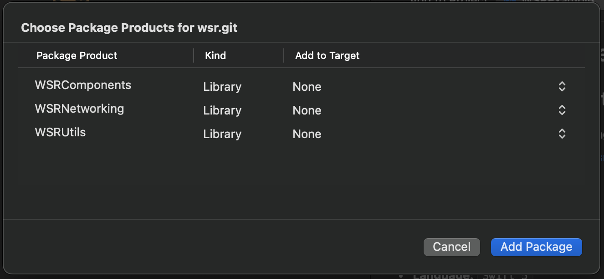
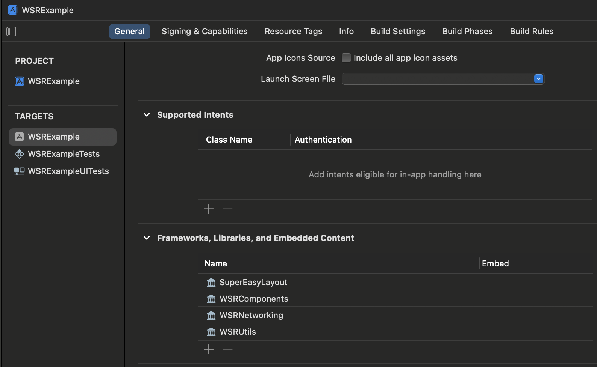

# WSR Swift Packager

A lightweight, pure-Swift library for customizing your components and apply swift concurrency.

## Features

- [x] Follows MVVM Architectural Design Pattern
- [x] Swift Concurrency Support Back to iOS 17
- [x] Combine Support
- [x] Property Wrappers
- [x] Data Persistency (User Defaults, Keychain)
- [x] Coordinator Design Pattern for Navigation Workflow
- [x] Custom Logger

## Component Libraries

### WSRCommon

1. Async Alert
1. Custom Errors
1. Observable Object

### WSRComponents

Library for UI customization and use of swift concurrency.

1. Buttons
1. Navigation Bar
1. Search Bar
1. TextField + Keyboard Handling
1. Collection View + Compositional Layout + Data Source

### WSRMedia

1. Image Cache
1. Sounds
1. FileLoader

### WSRNetworking

Library for http request using URLSession.

1. Async Requests

### WSRStorage

1. User Defaults + Property Wrapper

### WSRUtils

1. Custom Logger

## Installation

### Swift Package Manager

The [Swift Package Manager](https://swift.org/package-manager/) is a tool for automating the distribution of Swift code and is integrated into the swift compiler.

* File > Swift Packages > **Add Package Dependency**
* Package URL [https://github.com/wilyamx/wsr.git](https://github.com/wilyamx/wsr.git)
* Select **Up to Next Major**

## Requirements

- **IDE:** `XCode 15.2 for iOS 17.2`
- **Language:** `Swift 5`
- **Interface:** `Storyboard`

### Package Dependencies

1. [SuperEasyLayout](https://github.com/doil6317/SuperEasyLayout) - apply UI constraints programmatically
1. [KeychainAccess](https://github.com/kishikawakatsumi/KeychainAccess.git) - makes using Keychain APIs extremely easy

## Code Usage

[Github Wiki](https://github.com/wilyamx/wsr/wiki)

## Author

William Saberon Reña, [wilyamx@gmail.com](wilyamx@gmail.com)
